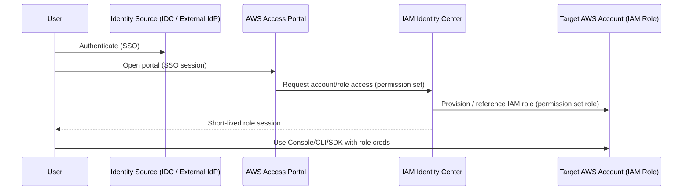

# AWS IAM Identity Center (SSO) — Production Guide

> Suggested repo path: `AWS-ZeroToHero/1_Identity_Access/3_IAM_Identity_Center_SSO/README.md`
AWS IAM Identity Center (successor to “AWS SSO”) is how you do **human access to multi-account AWS** with **centralized permission sets**, SSO, and short-lived sessions.

---

## Table of contents
- [What Identity Center is](#what-identity-center-is)
- [Core concepts](#core-concepts)
- [How access works end-to-end](#how-access-works-end-to-end)
- [Org instance vs account instance](#org-instance-vs-account-instance)
- [Setup checklist (admin)](#setup-checklist-admin)
- [Permission sets](#permission-sets)
- [Session duration model](#session-duration-model)
- [Developer workflow (AWS Console + CLI + SDK)](#developer-workflow-aws-console--cli--sdk)
- [Security & governance best practices](#security--governance-best-practices)
- [Troubleshooting playbook](#troubleshooting-playbook)
- [Hands-on labs](#hands-on-labs)
- [Terraform (baseline snippets)](#terraform-baseline-snippets)
- [References](#references)

---

## What Identity Center is
Identity Center provides:
- **One login** for users to access **AWS accounts** and supported **applications** via the **AWS access portal**
- Central permission management via **permission sets** (mapped into IAM roles in target accounts)

---

## Core concepts

### AWS access portal
The AWS access portal is the user-facing landing page where workforce users sign in once and then access:
- AWS accounts (role-based access)
- Applications integrated with Identity Center

### Identity source (where users/groups come from)
You can use:
- Identity Center’s built-in directory, or
- An external IdP (**SAML** for authentication + **SCIM** for user/group provisioning)

### Permission set (the central “role template”)
A permission set defines what a user/group can do in an AWS account. Identity Center provisions it into accounts by creating/maintaining an IAM role per permission set assignment.

### Assignment
Assignments bind:
- **principal** (user or group)
- **permission set**
- **target** (AWS account)

---

## How access works end-to-end
High-level flow:

1. User authenticates to your identity source (built-in directory or external IdP)
2. User enters the **AWS access portal**
3. User chooses an AWS account + permission set
4. Identity Center issues a session and the user assumes the corresponding IAM role in that account
5. Console/CLI/SDK calls are made using short-lived role credentials

Mermaid view:

Org instance vs account instance
Organization instance (recommended for multi-account)

If Identity Center is integrated with AWS Organizations, you can centrally manage permissions across multiple accounts.

Account instance (limited)

Account instances do not support multi-account AWS account access the same way (not suitable for centralized org-wide access control).

Setup checklist (admin)
1) Enable Identity Center

Enable IAM Identity Center in the management account (best with AWS Organizations integration).

2) Choose your identity source

Pick one:

Identity Center directory (fastest to start), or

External IdP:

Configure SAML 2.0 for authentication

Configure SCIM for automatic provisioning of users/groups

Ensure users/groups exist in Identity Center before making assignments

3) Create users and groups

Prefer groups as the unit of assignment (e.g., platform-admin, devops-prod-read, developers)

If using external IdP, rely on SCIM sync for lifecycle events (join/leave)

4) Create permission sets

Create baseline permission sets first (ReadOnly, PowerUser, Admin, Billing, SecurityAudit, etc.)

Add policies (managed policies / customer managed policies / inline policies)

Configure permission set properties (session duration, relay state, etc.)

5) Assign access (users/groups → accounts)

Assign groups to accounts using permission sets

Validate in the AWS access portal (user sees account tiles + permission sets)

Permission sets
What you can attach to a permission set

AWS managed policies

Customer managed policies

Inline policies

Job function policies (AWS managed “job function” variants)

A permissions boundary can also be applied

Note: by default you can add up to 10 total AWS managed + customer managed policies to a permission set (quota can be increased if needed).

Recommended permission set design (production)

Create small, clear sets:

ReadOnly-<env> (no data-plane destructive actions)

PowerUser-<env> (dev workflows, no IAM/org-wide admin)

Admin-<env> (limited to platform/admin group)

BreakGlass (tight controls + monitoring, minimal membership)

Prefer customer managed policies for consistency and versioning.
Use inline policies only when the scope is truly unique to one permission set.

Permission set UX: Relay state (optional)

Relay state lets you land users directly in a specific AWS Console page after they choose a permission set.

Permission revocation behavior

Identity Center supports controls to ensure users lose access when permissions are revoked, including approaches that use deny policies for active sessions.

Session duration model

There are two session durations to understand:

1) Permission set session duration (AWS account role session)

Controls how long the user stays signed in to the AWS account session for that permission set:

Range: 1 to 12 hours

Default: 1 hour

Configured per permission set

2) AWS access portal session duration (portal login session)

Controls how long the user stays signed in to the AWS access portal before needing to re-authenticate:

Default: 8 hours

Maximum configurable up to 90 days (organization policy dependent)

External IdP considerations

If you use an external IdP, IdP session settings and SAML assertion attributes can influence/limit user experience; plan portal and permission set durations intentionally.

Developer workflow (AWS Console + CLI + SDK)
Console access

User signs into AWS access portal

Choose account + permission set

“Management console” opens using the provisioned IAM role session

AWS CLI v2 (recommended): SSO token provider configuration
1) Configure
aws configure sso
# or configure only the reusable session block:
aws configure sso-session
2) Login
aws sso login --profile my-dev
3) Use the profile
aws sts get-caller-identity --profile my-dev
aws eks list-clusters --profile my-dev
4) Logout (optional)
aws sso logout
Manual ~/.aws/config example (token provider + reusable sso-session)
[profile dev]
sso_session = my-sso
sso_account_id = 111122223333
sso_role_name = SampleRole
region = ap-south-1
output = json

[sso-session my-sso]
sso_region = us-east-1
sso_start_url = https://my-sso-portal.awsapps.com/start
sso_registration_scopes = sso:account:access
Token refresh behavior (why “token provider” matters)

With the recommended token provider config:

The access token is checked periodically and refreshed using the refresh token

If the refresh token expires, you must re-login (aws sso login)

Avoid legacy “non-refreshable” configs unless you have a compatibility reason.

Security & governance best practices
Identity & lifecycle

Use an external IdP + SCIM for enterprise lifecycle (join/leave) if available

Assign access via groups, not individuals

Enforce MFA at the IdP (and conditional access policies)

Least privilege & blast radius

Keep permission sets small and environment-scoped (dev/stage/prod separation)

Keep Admin limited; have a clearly controlled BreakGlass path

Use customer managed policies as the default; version control them in Git

Sessions

Shorter permission set duration for privileged roles

Align portal session duration with corporate IdP standards

Auditability

Use consistent naming (permission set names map to roles)

Ensure CloudTrail is enabled org-wide so role sessions are attributable

Troubleshooting playbook
User can’t see an account/role in the portal

Validate: user/group exists in Identity Center (SCIM sync OK)

Validate: group is assigned to the target account with a permission set

CLI fails: “The SSO session associated with this profile has expired…”

Run: aws sso login --profile <name>

Confirm you are using the recommended sso_session configuration

CLI auth works but AWS calls fail with AccessDenied

Confirm which role you are using:

aws sts get-caller-identity --profile <name>

Fix the permission set policies (or account-side guardrails like SCPs / boundaries).

“Wrong account/role” in CLI

Check ~/.aws/config profile mapping: sso_account_id and sso_role_name

Ensure you didn’t reuse a profile name unintentionally

Hands-on labs
Lab 01 — Enable Identity Center + create a basic permission set

Enable Identity Center with Organizations

Create permission set ReadOnly-Dev

Assign a test group to a dev account

Validate portal access

Lab 02 — Build a “PlatformPowerUser” permission set

Attach AWS managed policies or customer managed policy

Add a small inline policy for one scoped exception

Validate via aws sso login + aws sts get-caller-identity

Lab 03 — Session duration tuning

Set permission set session duration to 1h vs 8h and observe behavior

Adjust portal session duration (if allowed) and document policy rationale

Lab 04 — External IdP integration (SAML + SCIM)

Configure SAML trust

Configure SCIM provisioning

Validate user lifecycle: create user → appears in Identity Center → assignment works

Terraform (baseline snippets)

Identity Center is manageable via Terraform using aws_ssoadmin_* resources.

Permission set (skeleton)
resource "aws_ssoadmin_permission_set" "read_only" {
  instance_arn     = data.aws_ssoadmin_instances.this.arns[0]
  name             = "ReadOnly-Dev"
  session_duration = "PT1H" # ISO-8601 duration
}
Account assignment (group → permission set → account)
resource "aws_ssoadmin_account_assignment" "read_only_dev" {
  instance_arn       = data.aws_ssoadmin_instances.this.arns[0]
  permission_set_arn = aws_ssoadmin_permission_set.read_only.arn

  principal_id   = data.aws_identitystore_group.devops.group_id
  principal_type = "GROUP"

  target_id   = "111122223333"
  target_type = "AWS_ACCOUNT"
}

Tip: Keep policy documents (customer managed policies) in Git, attach them to permission sets, and promote across environments.